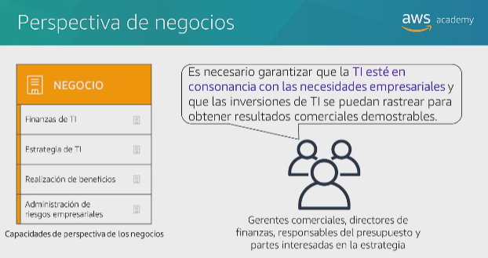

# General information about cloud concepts

# Section 1: Introduction to cloud computing

CC: entrega bajo demanda de potencia de computo, bd, almacenamiento y aplicaciones y otros recursos de TI, a traves de internet con un sistema de precios de pago por uso.

CC: permite dejar de considerar la infraestructura como hardware y en cambio verla y usarla como software.

Data center: almacena el software

El objetivo es utilizar la informatica en la nube como software y no como hardware.

## Modelos de servicio en la nube 
Cada uno proporciona un control distinto de los recursos TI

Iaas (Infrastucture as a service)

Paas (Platfortm as a service): deployment and management 

Saas (Sofware as a service): web mail application without think about hardware and low level config

## Modelos de implementacion de informatica en la nube

Nube: located only in cloud 

Hibrido: they are not located in cloud, they are in physical infrastucture

Infraestructura local (nube privada): dedicate resources

## Section 2: Cloud Computing Advantages 
Number one
- Cambiar sus gastos de capital (CapEx, fondos que utiliza una empresa para adquirir, actualizar y mantener los activos fisicos) por gastos variables
- Inversion en data centers segun las previsiones
- Pagar solo por la cantidad que consuma

Number two
- Debido al uso acumulado por parte de todos los clientes, AWS puede lograr mayores econonomias de escala y transferir ahorros a otros clientes

Number three
- Evitar asumir estimaciones sobre capacidad: capacidad del servidor sobreestimada o subestimada, por ende se realiza un ajuste de escala bajo demanda

Number four
- Aumenta la velocidad y la agilidad

Number five
- Dejar de gastar dinero en ejecucion y el mantenimiento de data centers, en lugar de ello la compañia puede centrarse en proyectos que la destaquen en luigar de enfocarse en la infraestructura 

Number six
- Desplegar, implementar la aplicacion en varias regiones de AWS alrededor del mundo  

## Section 3: Introduction to AWS(Amazon Web Services)

AWS

Es una plataforma en la nube segura que ofrece un amplio conjunto de productos globales basados en la nube.

AWS proporciona acceso bajo demanda a recursos informaticos de almacenamiento, red, bds, y otros recursos de TI y herramientas de administracion.

Ofrece flexibilidad

Solo paga por los servicios individuales que necesita, en la medida en que los utilice.

Los servicios en AWS trabajan en conjunto como piezas fundamentales.

## Categorias de servicios de AWS

La eleccion del servicio depende de sus objetivos empresariales y requisitos tecnologicos

- Amazon EC2: complete control over your AWS compute resources and infrastructure.

- AWS Lambda: when you want to run code and not manage or provision services.

- AWS Elastic Beanstalk: allows you to provision a service that then deploy management scales web applications automatily for you 

- Amazon Ligthsail: cloud platform for a simple web application 

- AWS Batch: you will use it when you run thousands or hundreds of batches works and you need to them reliably

- AWS Outposts: when you want to run AWS infrastructure on your own data center.

In order to implement microservices you can use: 
- AWS Fargate
- Amazon ECS: Elastic Container Service
- Amazon EKS: Elastic Kubernetes Service

- VMware Cloud on AWS: cuando se tiene una plataforma de virtualizacion de servidores en las instalaciones que desee migrar a AWS

Course services that we'll see:

## Formas de interactuar con AWS

- Consola de administracion de AWS: interfaz grafica facil de usar

- Interfaz de linea de comandos (AWS CLI): acceso a los servicios mediante comandos discretos o scripts

- Kits de desarrollo de software (SDK): acceso a los servicios directamente desde el codigo como Java, Python, etc 

## Section 4: Migracion a la nube de AWS - Marco de adopcion de la nube de AWS ( AWS Cloud Adoption Framework) (CAF de AWS)

Facilita el proceso de migracion a la nube para las compañias de acuerdo a distintos aspectos:

3 elementos deben estar en completa sintonia: personas, procesos y tecnologia.

Las perspectivas: Negocio, Gente y Gobernanza se enfoca en las capacidades empresariales

Las perspectivas: Plataforma, seguridad y operaciones se enfoca en las capacidades tecnicas

