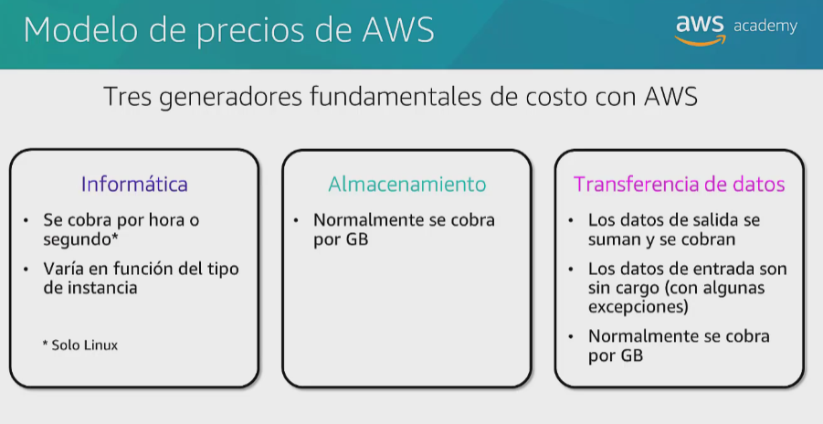
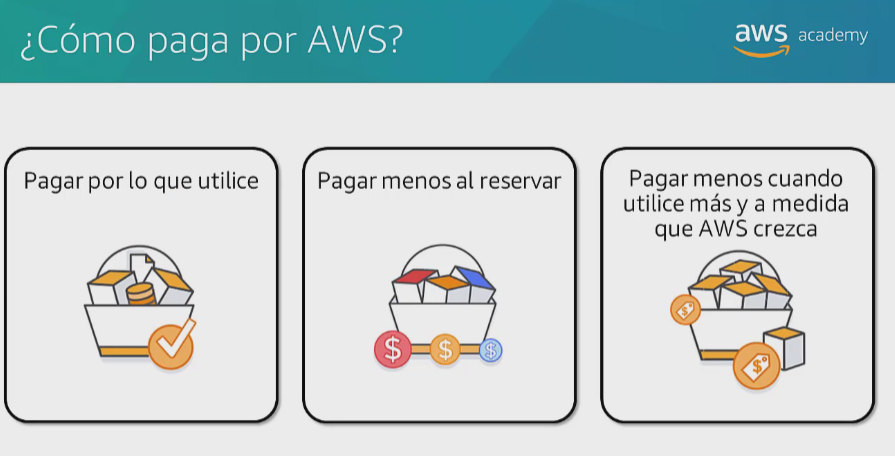
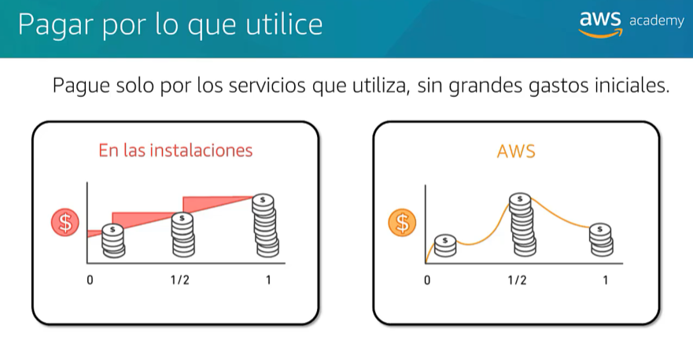
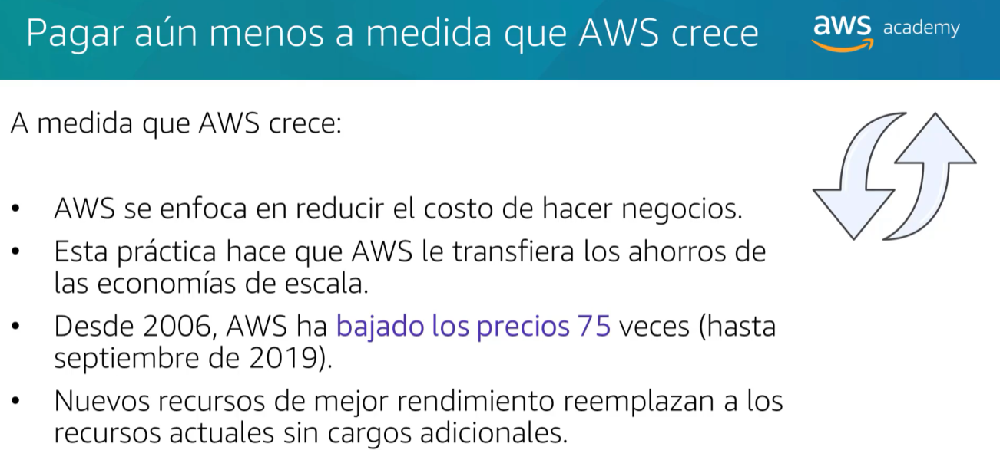
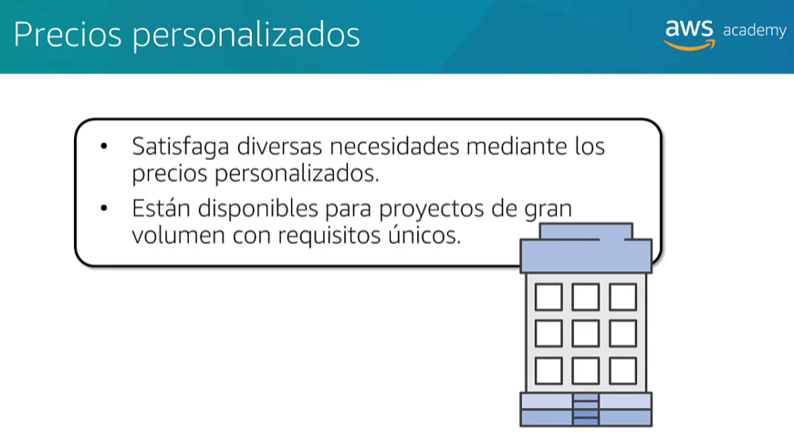
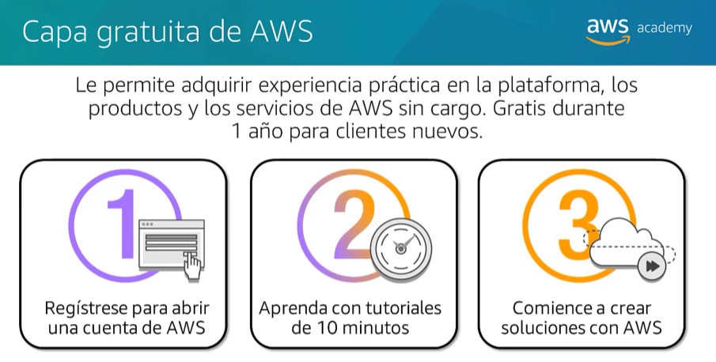
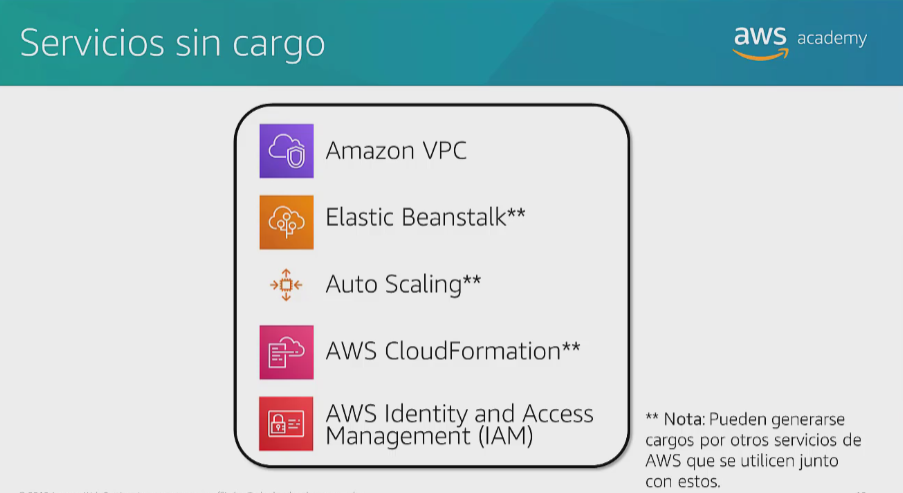

## Cloud economics and billing

## Section 1: Aspectos fundamentales de los precios

Existen 3 generadores fundamentales de costo con AWS

- Computing

- Storage

- Outbound Data transfer: la transferencia de datos entre servicios dentro de la misma region suele ser gratuita. El monto correspondiente aparece en el extracto mensual como transferencia saliente de datos de AWS. 

## You pay for what you use

No es necesario dedicar valiosos recursos a la construccion de una infraestructura costosa. Asi se ahorrara compra de servidores y renta de instalaciones. 

Todos los servicios estan disponibles bajo demanda. 

Ademas no requieren pagos iniciales ni contratos a largo plazo.

## You pay less if you use more

## Precios personalizados

## Capa gratuita de AWS

### Free Services for one year
- (ONLY ONE) Microinstancia T2 de Amazon EC2
For storage:
- Amazon S3
- Amazon EBS 

## Section 2: costo total de propiedad

Infraestrura tradicional: la inversión de capital incluye gastos de instalaciones, hardware, licencias y personal de mantenimiento.

### Costo total de propiedad (TCO)
Corresponde a la estimación financiera que ayuda a identificar los costos directos e indirectos de un sistema.
Se suele utilizar para comparar el costo de ejecutar un entorno de infraestructura completo o una carga de trabajo especifica en las instalaciones con el costo de hacerlo en AWS.
Concretamente permite presupuestar y desarrollar el caso de negocio para migrar a la nube.

### Consideraciones sobre el costo total de propiedad

## Caso práctico: costo total de propiedad - Delaware North (gastronomía y hotelería)

## Section 3: AWS Organizations

Se utiliza para la facturación unificada de varias cuentas de AWS en un árbol organizativo.
Cada rama corresponde a un departamento.

## Section 4: Administración de costos y facturación de AWS
Servicio que permite pagar la factura de AWS, monitorear su uso y presupuestar costos.

## Tools
- Presupuestos AWS
- Informes de uso y costo de AWS
- AWS Cost Explorer

- AWS Bills Page: costo en el transcurso del último mes en cada servicio de AWS, desglosado por región de AWS y por cuenta vinculada.
- Budgets (presupuestos): creación de notificaciones en caso de superar el presupuesto mensual, las alertas pueden enviarse via email o a través de Amazon Simple Notification Service - Amazon SNS. 
- AWS reports: lugar donde se puede acceder a la información completa acerca del uso y los costos de AWS, por categoria y cuenta. Es posible hacer que AWS publique informes de facturación en un bucket de S3. El informe puede actualizarse una vez al dia. 
